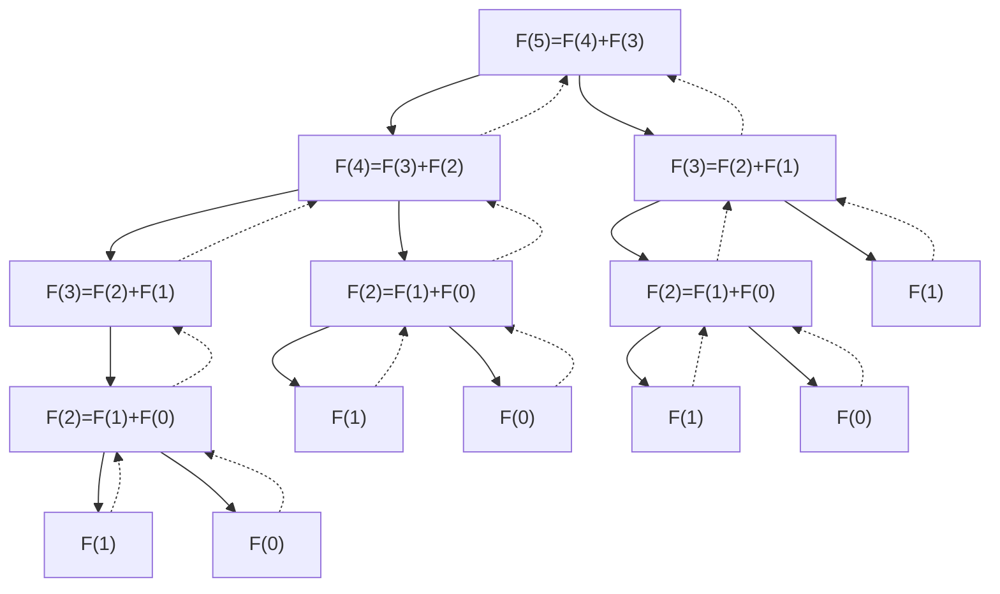
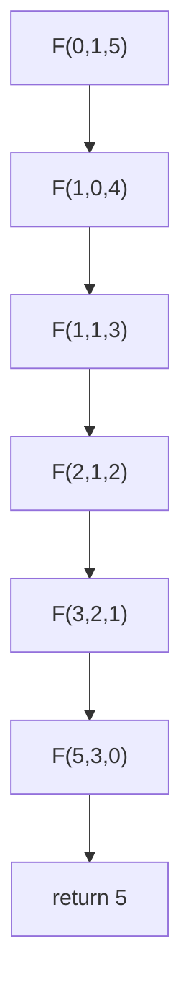

## 一、实验内容

利用MIPS汇编实现求解斐波那契数列第N项值的内容。

## 二、设计思想

### 1.主函数

```flow
st=>start: 开始
e=>end: 结束
io1=>inputoutput: 输入N
fib=>subroutine: 调用FIB函数求解
io2=>inputoutput: 输出结果
st->io1->fib->io2->e
```

### 2.FIB函数

斐波那契数列定义如下：
$$
F(N)=\begin{cases} 0,N=0\\1,N=1\\F(N-1)+F(N-2),N\geq2\end{cases}
$$
基本实现方式有两种：

1. 迭代算法
2. 递归算法

#### 1) 迭代算法

迭代法即模拟数列定义，从首项开始计算出每一项，直到目的项。

迭代算法流程如下：

```flow
st=>start: 开始
e=>end: 结束
io1=>inputoutput: 输入N
io2=>inputoutput: 输出F(N)
op1=>operation: 初始化数列首项F(0)=0,F(1)=1
循环计数器置1
cond1=>condition: 达到目的项？
op2=>operation: 递推
op3=>operation: 取目的项F(N)

st->io1->op1->cond1->e
cond1(no)->op2->cond1
cond1(yes)->op3->io2->e
```
#### 2) 递归算法

递归是指函数/过程/子程序在运行过程序中直接或间接调用自身而产生的重入现象。即递归是一个过程：函数不断引用自身，直到引用的对象已知。

使用递归的四大法则如下：

1. 基准情形： 必须有某些基准情形，它无需递归即可解出。
2. 不断推进： 对于需要递归求解的情形，每次递归调用都必须使得求解状况朝着基准情形推进。
3. 设计法则： 假设所有的递归调用都能运行。
4. 合成效益法则：在求解一个问题的同一实例时，切勿在不同的递归调用中做重复性工作。 

其中第四点在递归的效率中至为关键。但一般写法难以满足第四点的要求，因此普通的递归算法效率并不高。

普通递归算法流程如下：


```flow
st=>start: 开始
e=>end: 结束
io1=>inputoutput: 输入N
io2=>inputoutput: 返回F(N)
cond1=>condition: N=0？
cond2=>condition: N=1？
cond3=>condition: N>1？
op1=>operation: F(N)=0
op2=>operation: F(N)=1
op3=>operation: F(N)=F(N-1)+F(N-2)

st->io1->cond1
cond1(yes,right)->op1->io2
cond1(no,down)->cond2
cond2(yes,right)->op2->io2
cond2(no,down)->cond3
cond3(yes,right)->op3->io2
cond3(no,down)->io2
io2->e
```

#### 3) 优化递归算法
在上面的递归算法中，我们容易发现这样的情况：



在最长的一条流程中，我们可以发现，深度随N值增大，而一般来说，一个函数在栈中需要一个栈空间来保存必要信息，随着递归层数增加，函数占用的栈空间也会增加，如上流程，最深层次如下：


|     STACK    |
| :----------: |
|     F(1)     |
|     F(2)     |
|     F(3)     |
|     F(4)     |
|     F(5)     |
| CALLER(MAIN) |

如果N值很大，且每个函数栈使用的空间也挺大，那么在递归到一定深度时，会耗尽系统栈空间。从而引起崩溃。因此在平常如果使用递归函数时，需考虑递归的深度和重复性问题。

在上面的递归算法中，并没有符合递归第四法则，引发了重复计算问题，效益低下，因此有必要开发更高效率的递归算法。

我们可以借用迭代的算法，将其写成递归的形式。优化递归算法流程如下：

```flow
s=>start: 开始
e=>end: 结束
io1=>inputoutput: 输入a,b,N(初始a=0,b=1)
c1=>condition: N>=1?
op1=>operation: F(a+b,a,N-1)
op2=>operation: 结果F(N)=a
io2=>inputoutput: 输出F(N)

s->io1->c1
c1(yes,right)->op1
c1(no,down)->op2->io2->e
```

可以看到，此处的F(a+b,a,N-1)将会是一条流程，执行到N=0时，将直接返回答案，而不用重复计算。还是以F(5)为例子：



这样就解决了重复计算的问题，那么还有一个就是栈深度的问题，可以发现这里每次调用函数，都是对参数进行操作，如果我们可以直接修改栈中的参数，再来到函数开头，重复函数功能，就可以利用一个函数栈进行多次函数操作。

|        stack         |
| :------------------: |
|        返回值        |
| 参数一(对此进行修改) |
| 参数二(对此进行修改) |
| 参数三(对此进行修改) |
|       返回地址       |

值得一提的是，这些优化操作是在汇编代码层上进行的，但在我们使用高级语言，如C/C++，来编写代码时，一般是不能手动利用某些代码来对寄存器或者栈来操作的，不过我们可以利用编译器来优化，实际上，我们写下的高级语言代码，在由编译器进行编译时，都会自动优化，从而提高效率。

## 三、函数原型声明与伪代码

#### 1) 迭代算法实现

函数原型： `int iterateFib(int n)`

伪代码：

```c
int iterateFib(int n)
{
    if (n > 46)                    // 最大不溢出数据
	{
		return -1;
	}
	int a = 0, b = 1, c;           // 迭代变量
	for (int i = 0; i < n; i++)	   // 循环迭代
	{
		c = a;                     // 保存a
		a = a + b;                 // 新的a为两数之和
		b = c;                     // 新的b为原来的a
	}
	return a;                      // 迭代结束，返回结果
}
```

#### 2) 普通递归算法实现

函数原型：`int recursFib(int n)`

伪代码：

```c
int recursFib(int n)
{
    if (n > 25)                    // 考虑到MIPS模拟器中的效率，让其在25时就不适用普通递归 
	{
		return -1;
	}
	if (n < 2)                     // 递归基，F(1)=1,F(0)=0
	{
		return n;
	}
	if (n > 1)
		return recursFib(n - 1) + recursFib(n - 2); // 按照定义递归操作
}
```

#### 3) 优化递归算法实现

函数原型：`int proRecursFib(int a, int b, int n)`

伪代码：

```c
int proRecursFib(int a, int b, int n)
{
	if (n >= 1) // 递归基：F(a,b,0)：return a
	{
		return proRecursFib(a + b, a, n - 1); // 否则递归
	}
	return a;   // 返回结果
}
```

## 四、交叉引用表

#### 1) iterateFib 交叉引用

|  伪代码  | MIPS寄存器 |
| :------: | :--------: |
| 返回地址 |    $ra     |
|  参数N   |    $a0     |
|  返回值  |    $v0     |
|  变量a   |    $s0     |
|  变量b   |    $s1     |
|  变量c   |    $s2     |
|  变量i   |    $s3     |

#### 2) recursFib 交叉引用

|    伪代码    | MIPS寄存器 |
| :----------: | :--------: |
|   返回地址   |    $ra     |
|    参数N     |    $a0     |
| 返回值result |    $v0     |
|    变量a     |    $s0     |

#### 3) proRecursFib 交叉引用

|  伪代码  | MIPS寄存器 |
| :------: | :--------: |
| 返回地址 |    $ra     |
|  参数1   |    $a0     |
|  参数2   |    $a1     |
|  参数3   |    $a2     |

## 五、MIPS代码

main函数用来测试三种算法，具体MIPS代码如下：

```assembly
.data
str1: .asciiz "\n\n Welcome to Fibonacci Sequence Calculator"
str2: .asciiz "\n\n Please input an index(N): "
str31: .asciiz "\n\n Using iterateFib   : The "
str32: .asciiz "\n\n Using recursFib    : The "
str33: .asciiz "\n\n Using proRecursFib : The "
str4: .asciiz " item in Fibonacci Sequence is "
str5: .asciiz "\n\n Continue(Y is again , others is exit)?"
str6: .asciiz "\n\n Bye~ Have a good day!\n"
str7: .asciiz "\n\n Wrong input . No negative!"
buf: .word 0
.text
main:
	la $a0,str1 	# 输出欢迎提示语
	li $v0,4
	syscall
again:
	la $a0,str2 	# 输出提示语
	li $v0,4
	syscall
	li $v0,5 		# 读取要打印的项数
	syscall
	bgez $v0,goon 	# 先来一个判断
	la $a0,str7 	# 如果输入的是负数，重新输入
	li $v0,4  
	syscall
	b again
goon:
	move $t0,$v0 	# 输入的是非负数，则符合要求，把N值放到$t0
firts:	
					# iterateFib 迭代法
	la $a0,str31 	# 输出 迭代提示语
	li $v0,4
	syscall
	move $a0,$t0 	# 输出N值
	li $v0,1
	syscall 
	la $a0,str4 	# 输出 提示语
	li $v0,4 
	syscall
	move $a0,$t0 	# 将N值赋给$a0
	addi $sp,$sp,-12 # 为函数调用申请函数栈空间
	sw $ra,8($sp) 	# 保存返回地址
    sw $a0,4($sp) 	# 存入参数 $a0
	jal iterateFib 	# 调用 迭代 函数
	lw $v0,($sp) 	# 从栈中取回返回值放到$v0
    lw $ra,8($sp) 	# 取回返回地址
    addi $sp,$sp,12 # 平衡栈空间
	bltz $v0,second # 由于函数定义中不符合规定的N值会返回-1，因此此处判断是否正确
					# 若是-1，则跳过不输出
	move $a0,$v0 	# 输出结果
	li $v0,1
	syscall
second:	
					# recursFib 普通递归法
	la $a0,str32 	# 输出 普通递归 提示语
	li $v0,4
	syscall
	move $a0,$t0 	# 输出N值
	li $v0,1
	syscall
	la $a0,str4 	# 输出提示语
	li $v0,4
	syscall
	move $a0,$t0 	# 将N值赋给$a0
	addi $sp,$sp,-12 # 为函数调用申请函数栈空间
    sw $ra,8($sp) 	# 保存返回地址
    sw $a0,4($sp) 	# 存入参数 $a0
    jal recursFib 	# 调用 普通递归 函数
    lw $v0,($sp) 	# 从栈中取回返回值放到$v0
    lw $ra,8($sp) 	# 取回返回地址
    addi $sp,$sp,12 # 平衡栈空间
	bltz $v0,third 	# 若返回-1，则跳过不输出
	move $a0,$v0 	# 输出结果
	li $v0,1
	syscall
third:	
					# proRecursFib 优化递归法
	la $a0,str33 	# 输出 优化递归提示语
	li $v0,4
	syscall
	move $a0,$t0 	# 输出N值
	li $v0,1
	syscall
	la $a0,str4 	# 输出提示语
	li $v0,4
	syscall
	li $a0,0 		# 初始参数1=0
	li $a1,1 		# 初始参数2=1
	move $a2,$t0 	# 参数3=N
	addi $sp,$sp,-20 # 为函数调用申请函数栈空间
	sw $a0,4($sp) 	# 存入参数1
	sw $a1,8($sp) 	# 存入参数2
	sw $a2,12($sp) 	# 存入参数3
	sw $ra,16($sp) 	# 保存返回地址
	jal proRecursFib # 调用 优化递归 函数
	lw $v0,($sp) 	# 从栈中取回返回值放到$v0
	lw $ra,16($sp) 	# 取回返回地址
	addi $sp,$sp,20 # 平衡栈空间
	bltz $v0,ask 	# 若返回-1，则跳过不输出
	move $a0,$v0 	# 输出结果
	li $v0,1
	syscall
ask:
	la $a0,str5 	# 输出提示语，是否继续执行
	li $v0,4
	syscall
	la $a0,buf 		# 读入用户输入
	li $a1,2
	li $v0,8
	syscall
	lw $t0,($a0) 	# 与字符 Y 作比较
	addi $t0,$t0,-0x59
	beqz $t0,again 	# 若相等，则继续执行，否则退出
	la $a0,str6 	# 输出退出提示语
	li $v0,4
	syscall
	li $v0,10 		# 退出程序
	syscall
```


#### 1) iterateFib

##### ① 函数使用约定：

```assembly
	addi $sp,$sp,-12 # 为函数调用申请函数栈空间
	sw $ra,8($sp) 	# 保存返回地址
    sw $a0,4($sp) 	# 存入参数 $a0
	jal iterateFib 	# 调用 迭代 函数
	lw $v0,($sp) 	# 从栈中取回返回值放到$v0
    lw $ra,8($sp) 	# 取回返回地址
    addi $sp,$sp,12 # 平衡栈空间
```

##### ② 完整MIPS代码：

```assembly
.data
iterStr1: .asciiz "\n\n Sorry the 32-bits register can't save so large a number QAQ~"
.text
iterateFib:
	addi $sp,$sp,-16 # 为临时变量开辟栈空间
    sw $s0,($sp) 	 # 以$s0,作为临时变量(a)，保存原值
    sw $s1,4($sp) 	 # 以$s1,作为临时变量(b)，保存原值
	sw $s2,8($sp) 	 # 以$s2,作为临时变量(c)，保存原值
	sw $s3,12($sp) 	 # 以$s3,作为临时变量(i)，保存原值
    lw $a0,20($sp) 	 # 从栈中取到参数(N) 赋给$a0
	addi $s0,$a0,-47 # 因为32-bits有限，这里令其不能计算超过第46项的元素，否则结果有误
	bltz $s0,ido1 	 # N<47则继续执行
	la $a0,iterStr1  # 否则输出提示语句并返回-1
	li $v0,4
	syscall
	li $s0,-1 		 # 返回-1
	b ov
ido1: 		 		 # 继续执行
	li $s0,0 		 # 初始化 a=0
	li $s1,1 		 # 初始化 b=1
	li $s3,0 		 # 初始化 i=0
lp: 		 		 # 迭代
	bge $s3,$a0,ov 	 # 若达到迭代终止条件(i=N),则返回结果
	addi $s3,$s3,1 	 # i++
	move $s2,$s0 	 # 迭代操作 c=a
	addu $s0,$s1,$s0 # 迭代操作 a=a+b
	move $s1,$s2 	 # 迭代操作 b=c
	b lp
ov: 				 # 迭代完成准备返回结果
	move $v0,$s0 	 # 此处$s0即可由错误返回处的(li $s0,-1)决定，也可有迭代过程的(addu 		 
					 # $s0,$s1,$s0)决定，保证了一致性
	lw $s0,($sp) 	 # 释放临时变量，恢复$s0
    lw $s1,4($sp) 	 # 释放临时变量，恢复$s1
	lw $s2,8($sp) 	 # 释放临时变量，恢复$s2
	lw $s3,12($sp) 	 # 释放临时变量，恢复$s3
	addi $sp,$sp,16  # 回收临时变量栈空间
	sw $v0,($sp) 	 # 存入返回结果
	jr $ra 			 # 返回caller处
```

#### 2) recursFib

##### ① 函数使用约定：

```assembly
	addi $sp,$sp,-12 # 为函数调用申请函数栈空间
    sw $ra,8($sp) 	# 保存返回地址
    sw $a0,4($sp) 	# 存入参数 $a0
    jal recursFib 	# 调用 普通递归 函数
    lw $v0,($sp) 	# 从栈中取回返回值放到$v0
    lw $ra,8($sp) 	# 取回返回地址
    addi $sp,$sp,12 # 平衡栈空间
```

##### ② 完整MIPS代码：

```assembly
.data
recStr1: .asciiz "\n\n Sorry due to the bad efficiency of ordinary recursFib , I don't want do do it QAQ~"
.text
recursFib:
    addi $sp,$sp,-4 # 为临时变量开辟栈空间
    sw $s0,($sp) 	# 以$s0,作为临时变量(a)，保存原值
    lw $a0,8($sp) 	# 从栈中取到参数(N) 赋给$a0
	addi $s0,$a0,-25 # 由于递归效率问题，当N太大时，PCSpim上运行起来很慢，这里取25，若是N>25
					#则不采用此算法，否则需要等几分钟甚至十几分钟
	bltz $s0,ido2 	# N<25继续执行
	la $a0,recStr1 	# 否则输出提示语句并返回-1
	li $v0,4
	syscall
	li $v0,-1
	b retn
ido2:				# 继续执行
    move $v0,$a0	# 
    slti $s0,$v0,2  # 如果参数N<2
    bnez $s0,retn   # 直接返回 (if n<2 : return n)
    addi $a0,$a0,-1 # 否则执行递归
    addi $sp,$sp,-12 # 为递归recursFib(n-1)做准备
    sw $ra,8($sp)
    sw $a0,4($sp)
    jal recursFib   # recursFib(n-1)
    lw $v0,($sp)    # 取得recursFib(n-1)的返回值
    lw $ra,8($sp)	# 函数收尾工作
    addi $sp,$sp,12
    move $s0,$v0    # 将recursFib(n-1)的返回值暂存入$s0
    lw $a0,8($sp)   # 为递归recursFib(n-2)做准备
    addi $a0,$a0,-2
    addi $sp,$sp,-12
    sw $ra,8($sp)
    sw $a0,4($sp)
    jal recursFib	# recursFib(n-2)
    lw $v0,($sp)    # 取得recursFib(n-2)的返回值
    lw $ra,8($sp)   # 函数收尾工作
    addi $sp,$sp,12
    addu $v0,$v0,$s0 # 将两个递归函数的返回值合并( recursFib(n - 1) + recursFib(n - 2) )
retn:
    lw $s0,($sp) 	# 释放临时变量，恢复$s0 
    addi $sp,$sp,4  # 回收临时变量栈空间
    sw $v0,($sp)    # 存入返回结果
    jr $ra			# 返回caller处 
```

#### 3) proRecursFib

##### ① 函数使用约定：

```assembly
	addi $sp,$sp,-20 # 为函数调用申请函数栈空间
	sw $a0,4($sp) 	# 存入参数1
	sw $a1,8($sp) 	# 存入参数2
	sw $a2,12($sp) 	# 存入参数3
	sw $ra,16($sp) 	# 保存返回地址
	jal proRecursFib # 调用 优化递归 函数
	lw $v0,($sp) 	# 从栈中取回返回值放到$v0
	lw $ra,16($sp) 	# 取回返回地址
	addi $sp,$sp,20 # 平衡栈空间
```

##### ② 完整MIPS代码：

```assembly
.data
proStr1: .asciiz "\n\n Sorry the 32-bits register can't save so large a number QAQ~"
.text
proRecursFib:
	lw $a0,4($sp)	 # 从栈中取到参数(a)
	lw $a1,8($sp)	 # 从栈中取到参数(b)
	lw $a2,12($sp)	 # 从栈中取到参数(N)
	addi $v0,$a2,-47 # 判断N大小是否符合要求
	bltz $v0,ido3	 # 符合则继续执行
	la $a0,proStr1	 # 否则输出提示语句并返回-1
	li $v0,4
	syscall
	li $a0,-1
	b over
ido3:				 # 继续执行
	slti $v0,$a2,1	 # 递归基 n<1
	bnez $v0,over	 # 达到递归基,则直接返回(return a)
	addu $a1,$a1,$a0 # 递归操作 递归参数参数1=a+b 
	addi $a2,$a2,-1	 # 递归操作 递归参数参数3=n-1
	sw $a1,4($sp)	 # 修改栈空间原参数1处为a+b 
	sw $a0,8($sp)	 # 修改栈空间原参数2处为a
	sw $a2,12($sp)	 # 修改栈空间原参数3处为n-1 
	b proRecursFib	 # 再次执行函数
over:				 # 返回
	move $v0,$a0	 # 返回值为参数一内容(return a)
	sw $v0,($sp)	 # 将返回值存入栈
	jr $ra			 # 返回caller处
```

## 六、运行结果

测试环境：PCSpim Version 8.0


正常运行，输入项数不那么大的测试数据，事实F(10)也等于55，正确。输入Y可以继续执行。


输入更大的数据，在运行期间明显感觉到在使用普通递归时，会延迟几秒才出答案。而当N为25以上时，所需等待的时间将会更大，当N等于30时，甚至需要几分钟时间，因此我在函数里设置当N大于25时就自动退出函数，避免影响执行效率。


由于32位寄存器存放的数值有限，实际上第47项已经超过32位有符号数，第48项超过32位无符号数，因此我在函数里设定好N超过46也直接跳出函数，并且返回-1。


最后输入 Y 以外的字符，顺利退出。


## 七、实验感想

在计算机语言的世界里，语言更新换代频繁，稳坐王位的Java最近也被Python逆袭，难说日后会不会又有新的语言取代Python，而能被称为“耐用”的语言，汇编乃当之无愧、不二之选。这门课程，可以说是值得学习的“编程世界的常青树”。

早在上学期，为了学习CTF中二进制方向的技术时，便初步学习了8086架构下的汇编，也就是常见的x86,x64的鼻祖。以前 没听说过MIPS，也不敢掉以轻心，还是得认真学习一下。在之前学习x86架构的时候，对于流程不懂时，经常会写一个c语言程序，并用 gcc 产生的可执行文件进行逆向分析，查看其汇编代码。但是苦于我使用的计算机并非MIPS架构，不能产生MIPS下的可执行文件，好在可以利用 linux 上一个的一个交叉编译器 mips-linux-gcc 配合 -s 指令，可以直接将c语言直接翻译成MIPS代码，有利于印证思路流程。

选择斐波那契数列这一课题，是因为年历的那一课题可以直接使用蔡勒公式求出周数，并不能体现汇编层次的重要性，而排序算法，也许在优化方面可以在汇编层次上下功夫，但还是不如这个斐波那契数列的递归背后的问题更容易说明汇编语言的重要性。

在上学期的C++课程中我们已经接触过了斐波那契数列，也知道他有很多种实现方法，迭代和递归便是最常用的方法。还记得当时学习递归时，授课老师便讲过，递归实现只是在编写代码时很简练，但是其效率是不如迭代的，而且，任何递归算法都可以用迭代来实现。因此我就使用MIPS来实现迭代和递归这两种方式的斐波那契数列。不考虑实际程序在编译过程中编译器的自动优化影响，递归时完全考虑函数栈的要求，即如上文中 recursFib 函数的MIPS代码，在每一个程序内部，都会开辟栈空间为另外两个递归调用存数据，其代价是很高的，不仅需要频繁的开栈退栈，还需要很大的一片栈空间以供深层递归，这就是为什么递归算法的效率不如迭代算法的问题所在，而且当深度很大时，甚至会耗尽栈空间，引起程序崩溃，若是程序开发过程中没有对递归函数设计的足够好，当引发无穷递归时，便会爆栈，使程序停止运行，这也是软件稳定性所需考虑的问题之一。纵使不推荐递归算法，但是递归算法的高度归纳性总是使得你写的高级语言很具有层次，所以还是有必要学习一下递归，这也引发了递归的优化问题。为了避免递归的频繁开栈退栈，尾递归的算法就现世了。尾递归即是在函数的尾部调用自身。在普通递归中，问题所在就是需要栈空间的操作，那么栈的目的是什么？无非就是传参和存返回值，如果能把这一步舍去，便可以消除栈上的开销，所以尾递归的实现便是重复利用函数栈，正如上文 proRecursFib 函数的结尾处，将新的参数直接覆盖旧的参数，并且回到函数头，从而避免了新开辟栈空间因此的开销，即解决了效率问题，也解决了需要大量栈空间的问题，从而对递归函数进行了优化。但是尾递归的实现还是得利用迭代式的结论才能实现，所以这就是为什么递归可以使用迭代来实现，且最好使用迭代。

学习汇编可以让我们更容易理解高级语言上的某些问题，如数据溢出，循环的实现，函数的实现及调用等，也有助于我们在开发算法时，可以在底层上考虑算法的复杂性，从而对算法做出优化。虽然在现实中，真正用到汇编的地方并不多，哪怕是嵌入式或单片机，都可以利用C语言进行编程，但是汇编知识总是有益处的。考虑到要在CTF的二进制方向上下功夫，我也会更下深入的学习几种架构的汇编，从而能对各平台下的程序进行逆向分析和漏洞挖掘。

## 八、附录

以上程序完整代码可以在 Github 上下载：

<https://github.com/Mask6asok/2019-Mips-report>